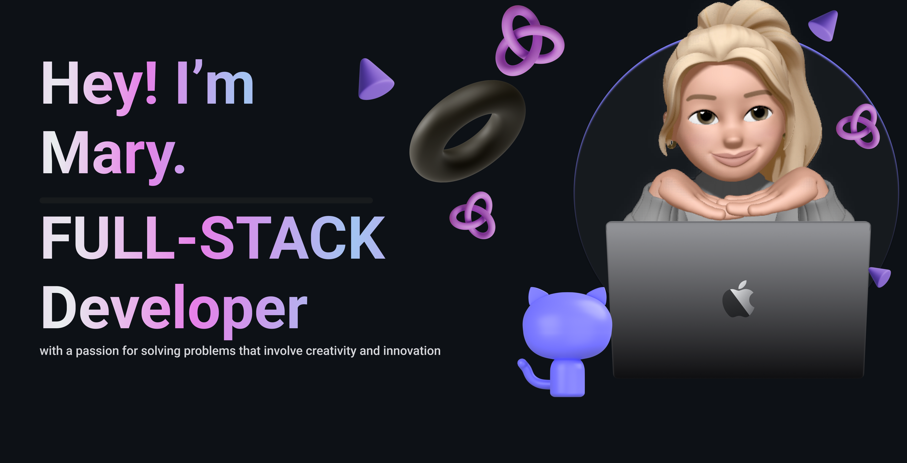

### 👋👋👋 Holla 👋👋👋👋
I am a Frontend-focused Software Developer with strong experience in React and Next.js and hands-on exposure to backend development. I build performant, accessible, and user-centric web applications, collaborate across teams, and enjoy solving real-world problems while improving both user and developer experience.

**😄 Pronouns**
- She
- Her
## 🧠 Primary Stack

## 🧩 Familiar With

## Frequently Used Language

## 🌍 Open Source
- Contributing to React / Next.js ecosystem projects - Frontend
- Focus on UI improvements, performance, and documentation

## 😎 More About Me? Promise not to bore you**

Over time I have gained a holistic perspective and a versatile skill set spanning from traditional engineering and modern technology, while also drawing from my experiences in Mechatronics Engineering and Metallurgy, I bring technical acumen, critical thinking, and a results-oriented mindset to my role as a Full Stack Developer/Mobile developer. This diverse background enhances my ability to tackle complex challenges and adapt to new technologies with ease.

Guided by a passion for innovation, I leverage my multidisciplinary expertise to drive impactful solutions in the evolving tech landscape. I am committed to continuous growth and exploration, pushing the boundaries of what is possible in the tech world.

## **🌱 I’m currently learning**

STACKS

OTHERS 
- Spanish 

**⚡ Fun fact**

- I'm a piano enthusiast and love playing 🎹 in my free time.

- I used leetcode to improve my problem solving skill and put my brain to work🙂
  
-  am completely obsessed with music

- When I'm not coding, you can often find me engrossed in novels, exploring new worlds through the pages of a book. Currently reading **Atomic Habit by James Clear**

- I love adventures and traveling. 

**📫 Connect with me on** 

